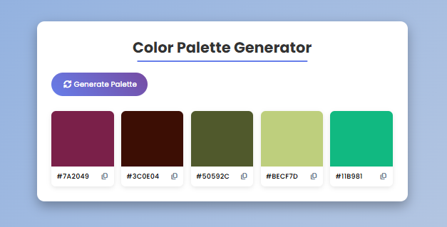

# Color Palette Generator

Gerador de paletas de cores aleatórias para uso rápido em design e desenvolvimento.

## Sobre
Aplicação web simples que gera e permite copiar paletas de cores em formato HEX. Projeto ideal para praticar DOM, eventos e manipulação de estilos com JavaScript, além de organização de layout com CSS Grid.

### Imagens do projeto:

### Demo
Acesse a demo ao vivo aqui: [Link para Demo](https://colorpalettegenerate.netlify.app)

## Tecnologias
- HTML5
- CSS3 
- JavaScript
- Font Awesome (via CDN)
- Google Fonts (via importação CSS)

## Como Usar
Opção 1 — Abrir diretamente
- Baixe/clones este repositório.
- Abra o arquivo index.html no navegador.

Opção 2 — VS Code (Live Server)
- Instale a extensão Live Server
- Clique em  Go Live dentro do index.html

## Estrutura
- index.html: marcação e import do CSS/JS
- styles.css: estilos e layout responsivo (CSS Grid)
- script.js: geração de cores, cópia para a área de transferência e atualização do DOM

## Scripts
Este projeto não possui package.json nem scripts de npm/yarn; é um app estático e pode ser executado diretamente no navegador.

## Autor
- Nome: João Vitor - Web Dev
- GitHub: https://github.com/joaovitor-webdev
- Portfólio: https://joaovitor-webdev.netlify.app
